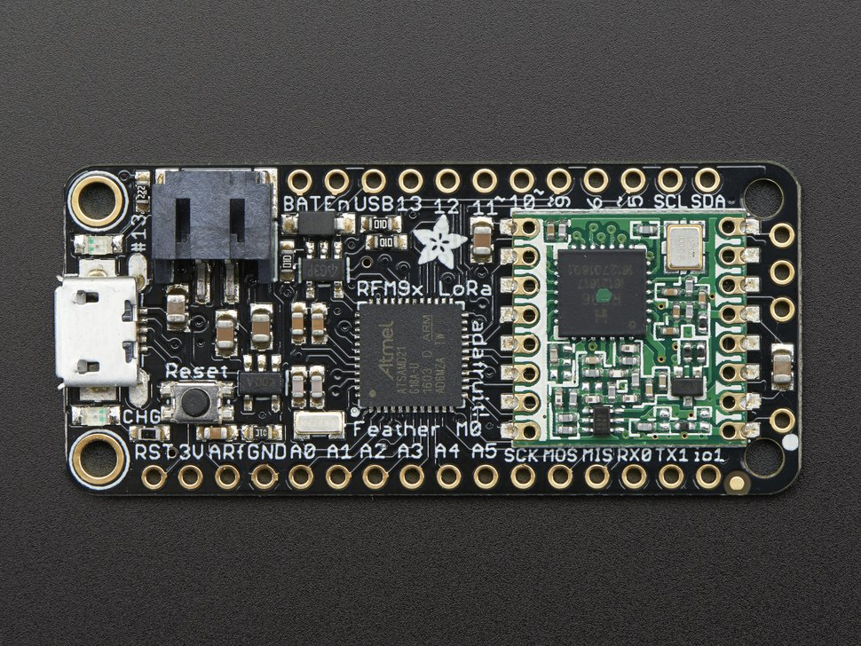
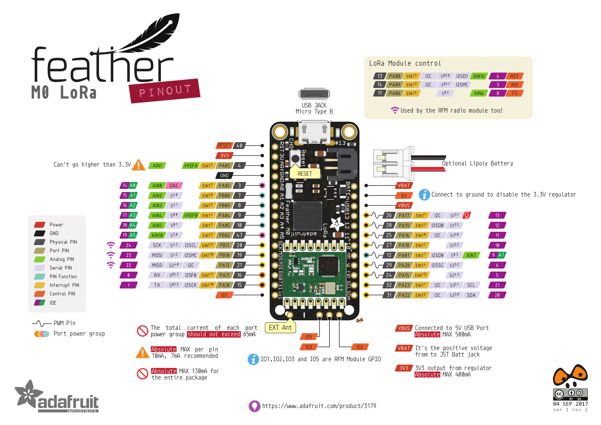
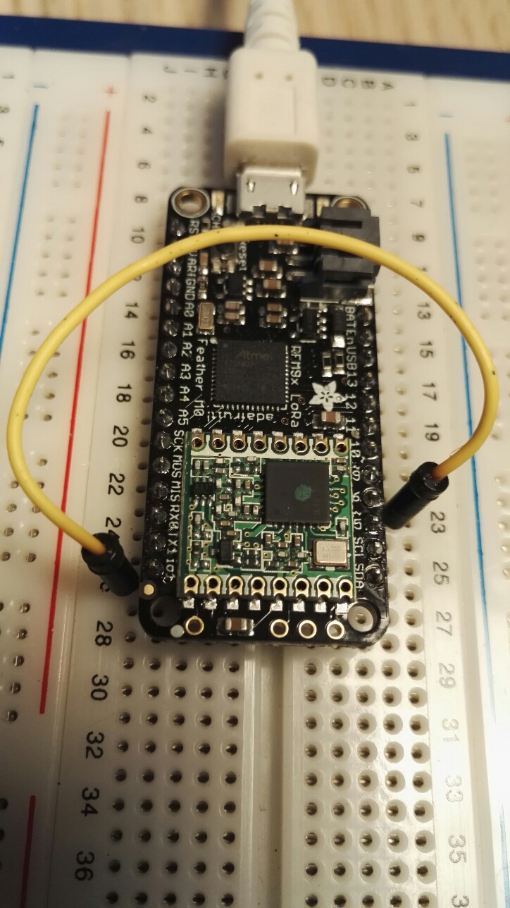
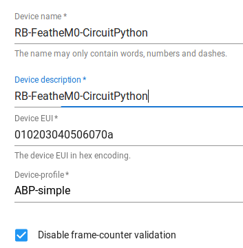
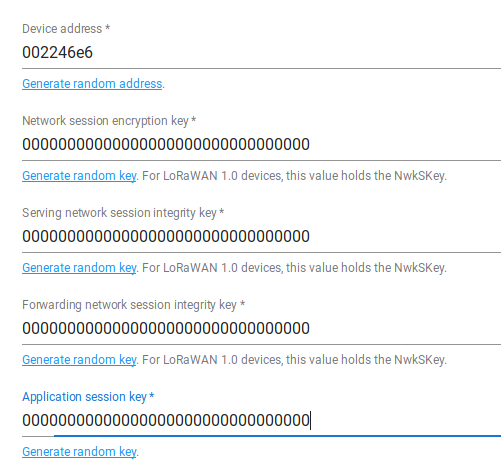

# Feather M0

## Présentation

Le Feather M0 RFM95 embarque un processeur ARM Cortex M0 à 48 MHz (le même que sur Arduino Zéro). Il a 256Ko de mémoire. Le module LoRa est un SX127x avec interface SPI.



[https://www.adafruit.com/product/3178](https://www.adafruit.com/product/3178)

Il n'y a pas d'antenne intégrée. Il suffit d'un fil pour faire une "quarter wave whip antenna" en le coupant à la bonne longueur. Ici 8,2 cm.

## LoRaWAN en C

On utilisera LMIC (LoRa Mac In C) et l'IDE Arduino. LMIC permet à un objet de se connecter à un réseau LoRaWAN. Se référer au link:../generic-lorawan-node-basic-join[tutoriel de connexion LoRaWAN] pour tous les détails sur l'utilisation de LMIC dans Arduino.

### Ajout des pilotes

Il faut ajouter les pilotes pour les cartes de la famille SAMD dont fait partie le Feather.

Dans Fichier/préférences, ajouter comme gestionnaire de cartes additionnelles l'adresse : [https://adafruit.github.io/arduino-board-index/package_adafruit_index.json](https://adafruit.github.io/arduino-board-index/package_adafruit_index.json)

Puis, Outils/Type de Cartes/gestionnaire de cartes, recherchez Feather et installer les librairies (Adafruit SAMD Boards).

Plus d'infos ici : [https://learn.adafruit.com/adafruit-feather-m0-radio-with-lora-radio-module/setup](https://learn.adafruit.com/adafruit-feather-m0-radio-with-lora-radio-module/setup)





### Câblage

Comme d'habitude, on ajuste ici `pinmap` pour indiquer à LMIC quelles sont les GPIO à utiliser pour se connecter à la radio LoRa.

Le paramétrage `pinmap` du Feather M0 pour la pile LMIC est le suivant :

``` c
const lmic_pinmap lmic_pins = {
    .nss = 8,
    .rxtx = LMIC_UNUSED_PIN,
    .rst = LMIC_UNUSED_PIN,
    .dio = {3, 6, LMIC_UNUSED_PIN},
};
```

Comme la plupart des pins sont déjà connectés entre eux sur la carte. Il nous reste à connecter le pin 6 de la feather à IO1 :



[https://wolfgangklenk.wordpress.com/2017/04/15/adafruit-feather-as-lorawan-node/](https://wolfgangklenk.wordpress.com/2017/04/15/adafruit-feather-as-lorawan-node/)

=== Sketch d'exemple

``` c
/*******************************************************************************
 * Copyright (c) 2015 Thomas Telkamp and Matthijs Kooijman
 * https://github.com/matthijskooijman/arduino-lmic/blob/master/examples/ttn-otaa/ttn-otaa.ino
 * Modifié par NG et RB (IUT de Blagnac)
 *
 * This uses OTAA (Over-the-air activation), where where a DevEUI and
 * application key is configured, which are used in an over-the-air
 * activation procedure where a DevAddr and session keys are
 * assigned/generated for use with all further communication.
 * 
 * To use this sketch, first register your application and device with
 * the tloraserver, to set or generate an AppEUI, DevEUI and AppKey.
 * Multiple devices can use the same AppEUI, but each device has its own
 * DevEUI and AppKey.
 *
 * Do not forget to define the radio type correctly in config.h.
 *
 *******************************************************************************/

#include <lmic.h>
#include <hal/hal.h>
#include <SPI.h>

/******************************************************************************/
/* LoRaWAN                                                                    */
/******************************************************************************/

// This EUI must be in *little-endian format* (least-significant-byte first)
// Necessaire pour le protocole mais inutile pour l'implémentation dans loraserver
// On peut donc mettre de l'aléatoire ou :

static const u1_t APPEUI[8]={ 0xF5, 0xD4, 0x54, 0x4B, 0x1C, 0xAB, 0x54, 0x1C };
 
// DEVEUI should also be in *LITTLE endian format*
 
//1a81070000000201 soit le YahIUT0201
 
static const u1_t DEVEUI[8]={ 0x01, 0x02, 0x00, 0x00, 0x00, 0x07, 0x81, 0x1a };
 
// This key should be in BIG endian format
// 00 00 00 00 00 00 00 00 1a 81 07 00 00 00 02 00
 
static const u1_t APPKEY[16] = { 0x00, 0x00, 0x00, 0x00, 0x00, 0x00, 0x00, 0x00, 0x1a, 0x81, 0x07, 0x00, 0x00, 0x00, 0x02, 0x00 };

// Copie en mémoire des EUI et APPKEY
void os_getArtEui (u1_t* buf) { memcpy_P(buf, APPEUI, 8);}
void os_getDevEui (u1_t* buf) { memcpy_P(buf, DEVEUI, 8);}
void os_getDevKey (u1_t* buf) { memcpy_P(buf, APPKEY, 16);}

// Schedule TX every this many seconds (might become longer due to duty
// cycle limitations).
const unsigned TX_INTERVAL = 60;

/******************************************************************************/
/* pin mapping                                                                */
/******************************************************************************/

const lmic_pinmap lmic_pins = {
    .nss = 8,
    .rxtx = LMIC_UNUSED_PIN,
    .rst = LMIC_UNUSED_PIN,
    .dio = {3, 6, LMIC_UNUSED_PIN},//io1 pin is connected to pin 6, io2 vers pin 11
};

/******************************************************************************/
/* payload                                                                    */
/******************************************************************************/

static uint8_t mydata[] = "RB";

/******************************************************************************/
/* Automate LMIC                                                              */
/******************************************************************************/

// return the current session keys returned from join.
void LMIC_getSessionKeys (u4_t *netid, devaddr_t *devaddr, xref2u1_t nwkKey, xref2u1_t artKey) {
    *netid = LMIC.netid;
    *devaddr = LMIC.devaddr;
    memcpy(artKey, LMIC.artKey, sizeof(LMIC.artKey));
    memcpy(nwkKey, LMIC.nwkKey, sizeof(LMIC.nwkKey));
}
static osjob_t sendjob;

void onEvent (ev_t ev) {
    Serial.print(os_getTime());
    Serial.print(": ");
    switch(ev) {
        case EV_SCAN_TIMEOUT:
            Serial.println(F("EV_SCAN_TIMEOUT"));
            break;
        case EV_BEACON_FOUND:
            Serial.println(F("EV_BEACON_FOUND"));
            break;
        case EV_BEACON_MISSED:
            Serial.println(F("EV_BEACON_MISSED"));
            break;
        case EV_BEACON_TRACKED:
            Serial.println(F("EV_BEACON_TRACKED"));
            break;
        case EV_JOINING:
            Serial.println(F("EV_JOINING"));
            break;
        case EV_JOINED:
            Serial.println(F("EV_JOINED"));
            {
              u4_t netid = 0;
              devaddr_t devaddr = 0;
              u1_t nwkKey[16];
              u1_t artKey[16];
              LMIC_getSessionKeys(&netid, &devaddr, nwkKey, artKey);
              Serial.print("netid: ");
              Serial.println(netid, DEC);
              Serial.print("devaddr: ");
              Serial.println(devaddr, HEX);
              Serial.print("artKey: ");
              for (int i=0; i<sizeof(artKey); ++i) {
                if (i != 0)
                  Serial.print("-");
                Serial.print(artKey[i], HEX);
              }
              Serial.println("");
              Serial.print("nwkKey: ");
              for (int i=0; i<sizeof(nwkKey); ++i) {
                      if (i != 0)
                              Serial.print("-");
                      Serial.print(nwkKey[i], HEX);
              }
              Serial.println("");
}

            // Disable link check validation (automatically enabled
            // during join, but not supported by TTN at this time).
            LMIC_setLinkCheckMode(0);
            break;
        case EV_RFU1:
            Serial.println(F("EV_RFU1"));
            break;
        case EV_JOIN_FAILED:
            Serial.println(F("EV_JOIN_FAILED"));
            break;
        case EV_REJOIN_FAILED:
            Serial.println(F("EV_REJOIN_FAILED"));
            break;
            break;
        case EV_TXCOMPLETE:
            Serial.println(F("EV_TXCOMPLETE (includes waiting for RX windows)"));
            if (LMIC.txrxFlags & TXRX_ACK)
              Serial.println(F("Received ack"));
            if (LMIC.dataLen) {
              Serial.println(F("Received "));
              Serial.println(LMIC.dataLen);
              Serial.println(F(" bytes of payload"));
            }
            // Schedule next transmission
            os_setTimedCallback(&sendjob, os_getTime()+sec2osticks(TX_INTERVAL), do_send);
            break;
        case EV_LOST_TSYNC:
            Serial.println(F("EV_LOST_TSYNC"));
            break;
        case EV_RESET:
            Serial.println(F("EV_RESET"));
            break;
        case EV_RXCOMPLETE:
            // data received in ping slot
            Serial.println(F("EV_RXCOMPLETE"));
            break;
        case EV_LINK_DEAD:
            Serial.println(F("EV_LINK_DEAD"));
            break;
        case EV_LINK_ALIVE:
            Serial.println(F("EV_LINK_ALIVE"));
            break;
         default:
            Serial.println(F("Unknown event"));
            break;
    }
}

// send fonction

void do_send(osjob_t* j){
    // Check if there is not a current TX/RX job running
    if (LMIC.opmode & OP_TXRXPEND) {
        Serial.println(F("OP_TXRXPEND, not sending"));
    } else {
        // Prepare upstream data transmission at the next possible time.
        LMIC_setTxData2(1, mydata, sizeof(mydata)-1, 0);
        Serial.println(F("Packet queued"));
    }
    // Next TX is scheduled after TX_COMPLETE event.
}

void setup() {
    Serial.begin(9600);
    while (millis() < 5000) {
    Serial.print("millis() = "); Serial.println(millis());
    delay(500);
  }
    Serial.println(F("Starting"));

    #ifdef VCC_ENABLE
    // For Pinoccio Scout boards
    pinMode(VCC_ENABLE, OUTPUT);
    digitalWrite(VCC_ENABLE, HIGH);
    delay(1000);
    #endif

    // LMIC init
    os_init();
    // Reset the MAC state. Session and pending data transfers will be discarded.
    LMIC_reset();
    LMIC_setClockError(MAX_CLOCK_ERROR * 10 / 100);
    // Start job (sending automatically starts OTAA too)
    do_send(&sendjob);
}

void loop() {
    os_runloop_once();
}
```

## LoRaWAN en python

MicroPython est une implémentation du langage de programmation libre, sous licence MIT, Python, adapté au monde des microcontrôleurs.

[CircuitPython](https://circuitpython.org/) est un _fork_ de MicroPython, qui a pour objectif de créer une API plus simple et plus uniforme tout en l'adaptant aux matériels dévloppé par Adafruit.

!!! warning
    Il y a un certain nombre de limitations pour LoRaWAN avec CircuitPython. Dans nos cas d'usage, rien de bloquant. Pour information, voir : [https://learn.adafruit.com/adafruit-feather-m0-radio-with-lora-radio-module/circuitpython-for-rfm9x-lora](https://learn.adafruit.com/adafruit-feather-m0-radio-with-lora-radio-module/circuitpython-for-rfm9x-lora)

### Installation de CircuitPython

Télécharger la dernière version de CircuitPython pour le Feather M0 RFM9x :

[https://circuitpython.org/board/feather_m0_rfm9x/](https://circuitpython.org/board/feather_m0_rfm9x/)

On y télécharge le fichier d'extension ".UF2"

!!! tip
    Une autre méthode consiste en télécharger le fichier ".bin" et flasher la carte avec le logiciel _bossac_

UF2 signifie "USB Flasher version 2". 

Appuyer deux fois (comme un double clic) sur le bouton reset de la carte. Un nouveau lecteur devrait apparaître avec le nom _FEATHERBOOT_. La carte est en mode bootloader.

Il suffit pour terminer de copier/coller le fichier *.UF2 dans ce lecteur.

L'installation se lance automatiquement puis un lecteur nommé circuitpy apparaît :


On peut tester l'installation avec le traditionnel _blink_. Dans le fichier `code.py` saisir : 

``` python
import digitalio
import board
import time

led = digitalio.DigitalInOut(board.D13)
led.direction = digitalio.Direction.OUTPUT
while True:
    led.value = not led.value
    time.sleep(0.5)
```

Une fois sauvegardé, le code est éxécuté au bout de quelques secondes.

### Ajout des bibliothèques

Pour ajouter des bibliothèques en plus, il suffit de les copier/coller dans le répertoire `lib` (le créer si nécessaire, attention à la casse).

De façon générale, on peut trouver des bibliothèques CircuitPython sur le GitHub d'Adafruit et via les tutoriels CircuitPython sur le Learning System d'Adafruit .

Le Feather M0 RFM9x a moins d'espace disponible que les autres cartes d'Adafruit. Nous allons donc ajoter que le strict nécessaire.

À partir du [répertoire contenant toutes les librairies](https://github.com/adafruit/Adafruit_CircuitPython_Bundle/releases/latest) disponibles, choisir seulement les répertoires :

* `adafruit_bus_device`
* `adafruit_tinylora`
* et le fichier `adafruit_si7021`

Choisir les fichiers "*.mpy" car ils sont compressés et les copier/coller dans le répertoire `lib`.

Pour gagner un peu d'espace, supprimer les fichiers `ttn_as.mpy`, `ttn_au.mpy`, `ttn_as.mpy` et `ttn_usa.mpy`.  Supprimer également la corbeille du lecteur (Maj+Suppr).

### Création du _device_ dans loraserver

L'authentification ne peut se faire qu'en ABP pour le moment.

Vérifier sur loraserver que vous avez bien un `device-profile` avec OTAA désactivé. 

Choisir une application et y crééer le device comme d'habitude en séelctionnant le bon `device-profile`.

Ici, nous l'avons mis dans l'application 5 avec l'identifiant 010203040506070a

Les clés sont celles par défaut (à changer)

Network key : 00000000000000000000000000000000

Application key : 00000000000000000000000000000000

Il est conseillé de cocher la case `Disable frame-counter validation` (moins de sécurité...)



On pourra aussi générer des valeurs aléatoires au lieu de faire comme suit :



### Code exemple

Toujours dans le https://github.com/adafruit/Adafruit_CircuitPython_Bundle/releases/latest[répertoire contenant toutes les librairies], on trouve un fichier zip contenant des exemples et notamment le fichier `tinylora_simpletest.py` :

``` python
import time
import busio
import digitalio
import board
from adafruit_tinylora.adafruit_tinylora import TTN, TinyLoRa

# Board LED
led = digitalio.DigitalInOut(board.D13)
led.direction = digitalio.Direction.OUTPUT

spi = busio.SPI(board.SCK, MOSI=board.MOSI, MISO=board.MISO)

# FeathM0 RFM9xPinout
cs = digitalio.DigitalInOut(board.RFM9X_CS)
irq = digitalio.DigitalInOut(board.RFM9X_D0)

# TTN Device Address, 4 Bytes, MSB
devaddr = bytearray([0x00, 0x22, 0x46, 0xe6])

# TTN Network Key, 16 Bytes, MSB
nwkey = bytearray([0x00, 0x00, 0x00, 0x00, 0x00, 0x00, 0x00, 0x00,
                   0x00, 0x00, 0x00, 0x00, 0x00, 0x00, 0x00, 0x00])

# TTN Application Key, 16 Bytess, MSB
app = bytearray([0x00, 0x00, 0x00, 0x00, 0x00, 0x00, 0x00, 0x00,
                 0x00, 0x00, 0x00, 0x00, 0x00, 0x00, 0x00, 0x00])

ttn_config = TTN(devaddr, nwkey, app, country='EU')

lora = TinyLoRa(spi, cs, irq, ttn_config)

data = bytes("Feather python RB", 'utf-8')

while True:
    #data = bytearray(b"\x43\x57\x54\x46")
    print('Sending packet..')
    lora.send_data(data, len(data), lora.frame_counter)
    print('Packet sent!')
    led.value = True
    lora.frame_counter += 1
    time.sleep(1)
    led.value = False
```

### Console série 

CircuitPython envoie la sortie d'un fichier .py en cours d'exécution vers la connexion USB-série.

Via n'importe quelle console, on peut donc voir les affichages et messages du programme. Par exemple :

```
  picocom -b 115200 /dev/ttyACM0
```

ou :

```
 screen /dev/ttyACM0 115200
```

Avec ce dernier Ctrl+C va permettre de passer en mode REPL (Read-Evaluate-Print-Loop). On se retrouve ainsi avec une console python avec laquelle intéragir.

## MQTT

On peut récupérer les données en MQTT :

 mosquitto_sub -h loraserver.tetaneutral.net -v -t "application/5/device/010203040506070a/rx"

## Références

[https://learn.adafruit.com/welcome-to-circuitpython/the-repl](https://learn.adafruit.com/welcome-to-circuitpython/the-repl)

[https://wolfgangklenk.wordpress.com/2017/04/15/adafruit-feather-as-lorawan-node/](https://wolfgangklenk.wordpress.com/2017/04/15/adafruit-feather-as-lorawan-node/)

[http://www.linuxembedded.fr/2017/12/introduction-a-lora/](http://www.linuxembedded.fr/2017/12/introduction-a-lora/)

[https://thingspeak.com/pages/learn_more](https://thingspeak.com/pages/learn_more)
