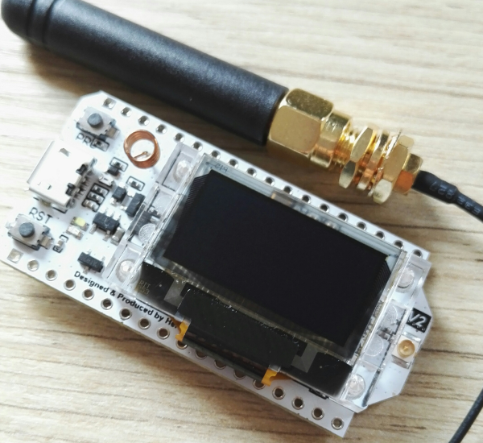

# Heltec WiFi LoRa 32

## Présentation

Cette carte de type ESP32 embarque des composants Wi-Fi, Bluetooth à basse consommation (BLE) et LoRa. Il y a aussi une antenne intégrée assez performante, un système de gestion de batterie Li-Po ainsi qu'un écran OLED de 0.96 pouces.

Plus d'informations sur le site du fabriquant : [https://heltec.org/project/wifi-lora-32/](https://heltec.org/project/wifi-lora-32)

La documentation complète se trouve ici : [https://heltec-automation-docs.readthedocs.io/en/latest/esp32/quick_start.html](https://heltec-automation-docs.readthedocs.io/en/latest/esp32/quick_start.html)

[https://github.com/HelTecAutomation/ESP32_LoRaWAN](https://github.com/HelTecAutomation/ESP32_LoRaWAN)

## Configuration de l'IDE Arduino

### Ajout du support de la carte

Cela se passe en deux étapes.

1. Dans le menu `Fichier/Préférences` ajouter le lien suivant dans le champ "URL de gestionnaires de cartes supplémentaires" : [https://resource.heltec.cn/download/package_heltec_esp32_index.json](https://resource.heltec.cn/download/package_heltec_esp32_index.json). Cela va rajouter le catalogue des cartes Heltec à la liste des cartes utilisables.

2. Ensuite, via le gestionnaire de cartes (via `Outils/Type de carte`), rechercher "Heltec ESP32" et l'installer.

### Ajout des bibliothèques Heltec ESP32

Via le gestionnaire de bibliothèque (`Croquis/Inclure une bibliothèque/Gérer les bibliothèques`), chercher "Heltec ESP32" et les installer.

### Ajout des bibliothèques LoRaWAN d'Heltec

Toujours via le gestionnaire de bibliothèques, installer `ESP32_LoRaWAN`.

Sinon, récupérer directement les bibliothèques ici : [https://github.com/HelTecAutomation/ESP32_LoRaWAN](https://github.com/HelTecAutomation/ESP32_LoRaWAN)

### Test de bon fonctionnement

On testera ensuite que tout fonctionne en allant téléverser un programme pris parmi les exemples (comme `XXXXXX_FactoryTest.ino`). Dans `Outils`, veiller à bien choisir la carte `WiFi LoRa 32(V2)`

!!! tip
    Les librairies Heltec utilisant `python`, il peut être nécessaire d'installer aussi le paquet `python-serial`.

## Connexion LoRaWAN

### Licence

!!! warning
    La bibliothèque Heltec ESP32 LoRaWAN a besoin d'une "license" pour pouvoir fonctionner... Il s'agit en fait d'une clé génrée à partir de l'ID de la puce de la carte. Voir ci-dessous.

Il faut récupérer le `chip ID`. Pour cela, exécuter le programme :

et récupérer le chip ID dans le moniteur série. Une fois fait, aller générer votre numéro de licence sur : [https://resource.heltec.cn/search](https://resource.heltec.cn/search). C'est une suite de code héxadécimaux de la forme : 0x79C3319B, 0x92BD...

Elle sera à ajouter dans le sketch plus tard.

### Ajouter l'objet à Chirpstack

Contactez-nous pour ajouter l'objet et vous remettre les clés nécessaires (`DevEui` et `AppKey`)

### Code exemple

On utilisera le code proposé par Heltec `OTAA_OLED.ino`.

Problème identifié : le compteur de frame ne serait pas incrémenté.

application/10/device/0260fc9256c4b5fe/error {"applicationID":"10","applicationName":"TestESP32","deviceName":"heltec","devEUI":"0260fc9256c4b5fe","type":"UPLINK_FCNT_RETRANSMISSION","error":"frame-counter did not increment","fCnt":1}

À suivre...

## MQTT

On peut s'abonner au flux MQTT de tous les objets de l'application où il a été positionné :

 mosquitto_sub -h loraserver.tetaneutral.net -v -t "application/10/#"

ou uniquement au flux MQTT de l'objet en question :

 mosquitto_sub -h loraserver.tetaneutral.net -v -t application/10/device/0000000000000000/#

