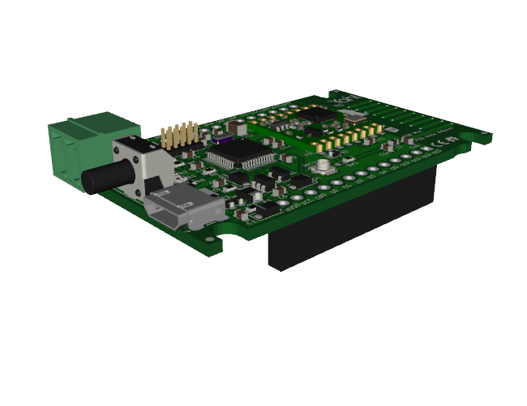
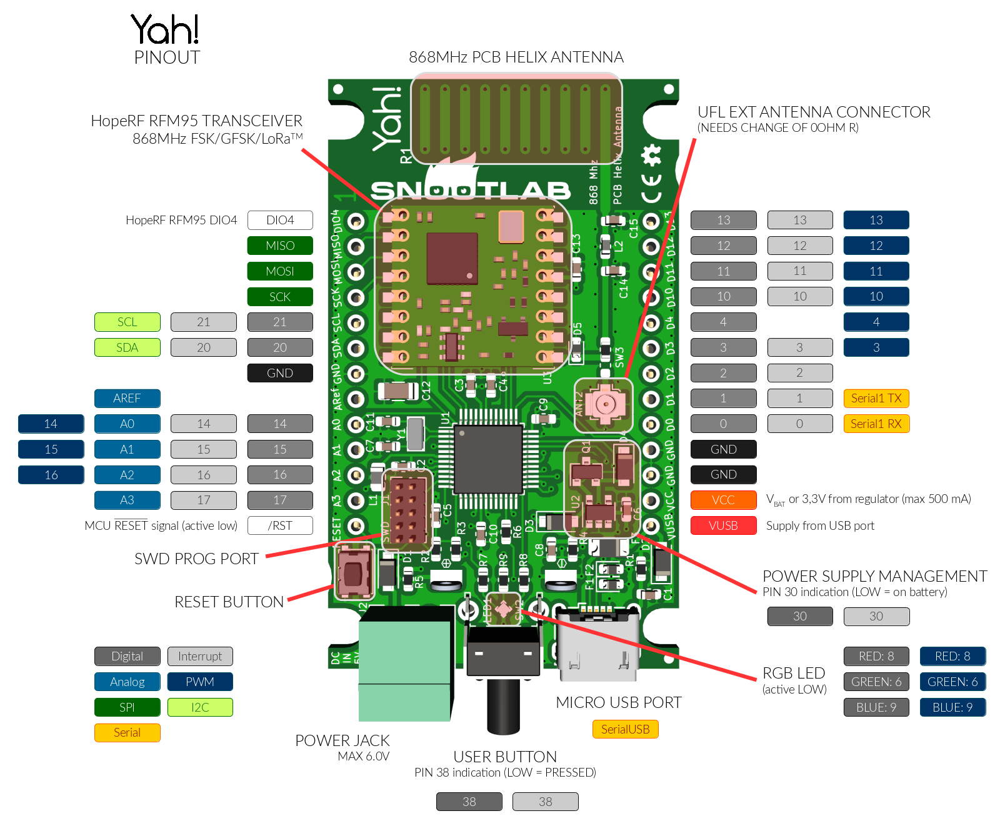

# Yah!

## Présentation

Le Yah! - ou Yahi pour "_Yet Another Hardware for !oT_" est un autre nœud LoRa de l'écosystème Arduino. Il est produit par https://www.snootlab.com[Snootlab]. Comme le Feather M0 qui embarque un processeur ARM Cortex M0 à 48 MHz, il est équivalent à l'Arduino Zero, mais vient avec un modem LoRa^TM^, une LED RVB, un bouton poussoir, un boitier plastique avec un logement pour deux piles AAA et une antenne 868 MHz intégrée et efficace. Le bouton USER, la LED RGB, le port USB et le connecteur d'alimentation débrochable restent accessible une fois le capot refermé. Pour les utilisations fixes du Yah!, le boîter peut être clippé sur une attache sur sa bordure inférieure. Il est possible d'étendre les capacités du Yah! en ajoutant un ou plusieurs _shields_ très intégrés.



Grâce à son boîtier compact, le Yah! permet de fabriquer des prototypes d'objets connectés _réellement utilisables_.

## Connexion au réseau LoRaWAN avec LMIC

La pile LMIC permet à un objet de se connecter à un réseau LoRaWAN. Se référer au link:../generic-lorawan-node-basic-join[tutoriel de connexion LoRaWAN] pour tous les détails sur l'utilisation de LMIC dans Arduino.

### Câblage

Le Yah! n'a pas besoin de câblage particulier pour supporter LMIC, à la différence du Feather ou de l'ESP32.

### DevEUI et clés de session

DEVEUI est l'identifiant unique de votre objet. En choisir un identifiant unique.

Attention, dans le code, il doit être saisis à l'envers.

Les paramètres APPEUI et APPKEY vous serons donnés par les gestionnaires de votre serveur de réseau.

!!! tip
    Lorsque le matériel va faire une demande de connexion au réseau LoRaWAN, celui-ci va comparer les clés définies dans loraserver avec celles indiquées par le matériel.

    S'il y a accord, le matériel pourra se connecter au réseau.

    En fonction du DEVEUI, le matériel sera alors classé dans une application (définie par les gestionnaires du serveur de réseau.)

### Arduino

Pour le type de carte, choisir : Arduino/Genuino Zero (Native USB Port)

### LMIC

Le Yah! supporte les différents modes de connexion au réseau comme détaillé dans le tutoriel de connexion à LoRaWAN.

Le paramétrage `pinmap` du Yah! pour la pile LMIC est le suivant :

``` c
const lmic_pinmap lmic_pins = {
    .nss = 31,
    .rxtx = LMIC_UNUSED_PIN,
    .rst = 19,
    .dio = {7, 5, 26},
};
```

### Sketch d'exemple : Hello world !

``` c
/*******************************************************************************
 * Copyright (c) 2015 Thomas Telkamp and Matthijs Kooijman
 * https://github.com/matthijskooijman/arduino-lmic/blob/master/examples/ttn-otaa/ttn-otaa.ino
 * Modifié par NG et RB (IUT de Blagnac)
 *
 * This uses OTAA (Over-the-air activation), where where a DevEUI and
 * application key is configured, which are used in an over-the-air
 * activation procedure where a DevAddr and session keys are
 * assigned/generated for use with all further communication.
 * 
 * To use this sketch, first register your application and device with
 * the tloraserver, to set or generate an AppEUI, DevEUI and AppKey.
 * Multiple devices can use the same AppEUI, but each device has its own
 * DevEUI and AppKey.
 *
 * Do not forget to define the radio type correctly in config.h.
 *
 *******************************************************************************/

#include <lmic.h>
#include <hal/hal.h>
#include <SPI.h>

/******************************************************************************/
/* LoRaWAN                                                                    */
/******************************************************************************/

// This EUI must be in *little-endian format* (least-significant-byte first)
// Necessaire pour le protocole mais inutile pour l'implémentation dans loraserver
// On peut donc mettre de l'aléatoire ou :

static const u1_t APPEUI[8]={ 0xF5, 0xD4, 0x54, 0x4B, 0x1C, 0xAB, 0x54, 0x1C };
 
// DEVEUI should also be in *LITTLE endian format*
 
//1a81070000000201 soit le YahIUT0201
 
static const u1_t DEVEUI[8]={ 0x01, 0x02, 0x00, 0x00, 0x00, 0x07, 0x81, 0x1a };
 
// This key should be in BIG endian format
// 00 00 00 00 00 00 00 00 1a 81 07 00 00 00 02 00
 
static const u1_t APPKEY[16] = { 0x00, 0x00, 0x00, 0x00, 0x00, 0x00, 0x00, 0x00, 0x1a, 0x81, 0x07, 0x00, 0x00, 0x00, 0x02, 0x00 };
// Copie en mémoire des EUI et APPKEY
void os_getArtEui (u1_t* buf) { memcpy_P(buf, APPEUI, 8);}
void os_getDevEui (u1_t* buf) { memcpy_P(buf, DEVEUI, 8);}
void os_getDevKey (u1_t* buf) { memcpy_P(buf, APPKEY, 16);}

// Schedule TX every this many seconds (might become longer due to duty
// cycle limitations).
const unsigned TX_INTERVAL = 20;

/******************************************************************************/
/* pin mapping                                                                */
/******************************************************************************/

const lmic_pinmap lmic_pins = {
    .nss = 31,
    .rxtx = LMIC_UNUSED_PIN,
    .rst = 19,
    .dio = {7, 5, 26},
};

/******************************************************************************/
/* payload                                                                    */
/******************************************************************************/

static uint8_t mydata[] = "IUT";

/******************************************************************************/
/* Automate LMIC                                                              */
/******************************************************************************/

// return the current session keys returned from join.
void LMIC_getSessionKeys (u4_t *netid, devaddr_t *devaddr, xref2u1_t nwkKey, xref2u1_t artKey) {
    *netid = LMIC.netid;
    *devaddr = LMIC.devaddr;
    memcpy(artKey, LMIC.artKey, sizeof(LMIC.artKey));
    memcpy(nwkKey, LMIC.nwkKey, sizeof(LMIC.nwkKey));
}
static osjob_t sendjob;

void onEvent (ev_t ev) {
    SerialUSB.print(os_getTime());
    SerialUSB.print(": ");
    switch(ev) {
        case EV_SCAN_TIMEOUT:
            SerialUSB.println(F("EV_SCAN_TIMEOUT"));
            break;
        case EV_BEACON_FOUND:
            SerialUSB.println(F("EV_BEACON_FOUND"));
            break;
        case EV_BEACON_MISSED:
            SerialUSB.println(F("EV_BEACON_MISSED"));
            break;
        case EV_BEACON_TRACKED:
            SerialUSB.println(F("EV_BEACON_TRACKED"));
            break;
        case EV_JOINING:
            SerialUSB.println(F("EV_JOINING"));
            break;
        case EV_JOINED:
            SerialUSB.println(F("EV_JOINED"));
            {
              u4_t netid = 0;
              devaddr_t devaddr = 0;
              u1_t nwkKey[16];
              u1_t artKey[16];
              LMIC_getSessionKeys(&netid, &devaddr, nwkKey, artKey);
              SerialUSB.print("netid: ");
              SerialUSB.println(netid, DEC);
              SerialUSB.print("devaddr: ");
              SerialUSB.println(devaddr, HEX);
              SerialUSB.print("artKey: ");
              for (int i=0; i<sizeof(artKey); ++i) {
                if (i != 0)
                  SerialUSB.print("-");
                SerialUSB.print(artKey[i], HEX);
              }
              SerialUSB.println("");
              SerialUSB.print("nwkKey: ");
              for (int i=0; i<sizeof(nwkKey); ++i) {
                      if (i != 0)
                              SerialUSB.print("-");
                      SerialUSB.print(nwkKey[i], HEX);
              }
              SerialUSB.println("");
}

            // Disable link check validation (automatically enabled
            // during join, but not supported by TTN at this time).
            LMIC_setLinkCheckMode(0);
            break;
        case EV_RFU1:
            SerialUSB.println(F("EV_RFU1"));
            break;
        case EV_JOIN_FAILED:
            SerialUSB.println(F("EV_JOIN_FAILED"));
            break;
        case EV_REJOIN_FAILED:
            SerialUSB.println(F("EV_REJOIN_FAILED"));
            break;
            break;
        case EV_TXCOMPLETE:
            SerialUSB.println(F("EV_TXCOMPLETE (includes waiting for RX windows)"));
            if (LMIC.txrxFlags & TXRX_ACK)
              SerialUSB.println(F("Received ack"));
            if (LMIC.dataLen) {
              SerialUSB.println(F("Received "));
              SerialUSB.println(LMIC.dataLen);
              SerialUSB.println(F(" bytes of payload"));
            }
            // Schedule next transmission
            os_setTimedCallback(&sendjob, os_getTime()+sec2osticks(TX_INTERVAL), do_send);
            break;
        case EV_LOST_TSYNC:
            SerialUSB.println(F("EV_LOST_TSYNC"));
            break;
        case EV_RESET:
            SerialUSB.println(F("EV_RESET"));
            break;
        case EV_RXCOMPLETE:
            // data received in ping slot
            SerialUSB.println(F("EV_RXCOMPLETE"));
            break;
        case EV_LINK_DEAD:
            SerialUSB.println(F("EV_LINK_DEAD"));
            break;
        case EV_LINK_ALIVE:
            SerialUSB.println(F("EV_LINK_ALIVE"));
            break;
         default:
            SerialUSB.println(F("Unknown event"));
            break;
    }
}

// send fonction

void do_send(osjob_t* j){
    // Check if there is not a current TX/RX job running
    if (LMIC.opmode & OP_TXRXPEND) {
        SerialUSB.println(F("OP_TXRXPEND, not sending"));
    } else {
        // Prepare upstream data transmission at the next possible time.
        LMIC_setTxData2(1, mydata, sizeof(mydata)-1, 0);
        SerialUSB.println(F("Packet queued"));
    }
    // Next TX is scheduled after TX_COMPLETE event.
}

void setup() {
    SerialUSB.begin(9600);
    while (millis() < 5000) {
    SerialUSB.print("millis() = "); SerialUSB.println(millis());
    delay(500);
  }
    SerialUSB.println(F("Starting"));

    #ifdef VCC_ENABLE
    // For Pinoccio Scout boards
    pinMode(VCC_ENABLE, OUTPUT);
    digitalWrite(VCC_ENABLE, HIGH);
    delay(1000);
    #endif

    // LMIC init
    os_init();
    // Reset the MAC state. Session and pending data transfers will be discarded.
    LMIC_reset();
    LMIC_setClockError(MAX_CLOCK_ERROR * 10 / 100);
    // Start job (sending automatically starts OTAA too)
    do_send(&sendjob);
}

void loop() {
    os_runloop_once();
}

```

## Divers

### Pinout

Le Yah! contient de nombreuses GPIO qui peuvent être utilisées pour étendre les possibilités matérielles du noeud.

Il comprend aussi une LED RVB et un bouton poussoir qui peuvent être utilisés pour permettre des interactions avec l'utilisateur.

* Le bouton poussoir est accessible entre entrée par la GPIO 38. Le niveau logique est bas sur pression, haut BP relâché. La GPIO peut être utilisée par scrutation avec l'appel à `digitalRead(38)` ou par interruption avec `attachInterrupt(38, foo, FALLING)`.
* La LED RVB est accessible en sortie par les GPIO 8, 6 et 9 en logique inversée (0V pour allumer la couleur). La LED peut être utilisée en Tout-ou-Rien par un appel à `digitalWrite()` ou en PWM par `analogWrite()`.



### Schéma fonctionnel

Le schéma fonctionnel du Yah! est le suivant.


