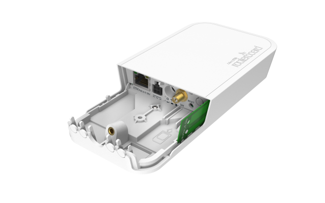
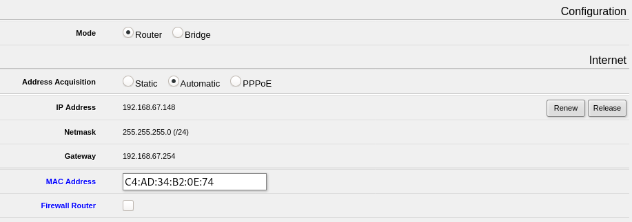

# MikroTik wAP LoRa8

_Cette page explique comment configurer la passerelle MikroTik wAP LoRa8 pour rejoindre le réseau de Tetaneutral._

Il s'agit d'une [passerelle LoRaWAN outdoor étanche](https://mikrotik.com/product/wap_lr8_kit) fabriquée par MikroTik et [d'un coût très abordable](https://www.mhzshop.com/shop/3G-4G-5G/LoRa/Gateway-LoRa-MikroTik-wAP-LoRa8-RBwAPR-2nD-R11e-LoRa8.html). Plus de détails sur la passerelle [ici](https://help.mikrotik.com/docs/display/UM/wAP+LR8+kit).



La gateway contient une antenne interne à faible gain, qui peut être utilisée en absence d'antenne externe connectée sur le port SMA. Par défaut, l'antenne interne est débranchée. Pour l'utiliser, il faut ouvrir le boîtier à l'aide d'un tournevis et inverser les câbles coaxiaux internes sur le connecteur uFL. Le port SMA n'est alors plus utilisable mais l'opération est réversible. Plus d'informations [ici](https://help.mikrotik.com/docs/display/UM/wAP+LR8+kit#heading-Antennausage). 

## Préparation

### Éléments à demander à un administrateur

* Demander à un administrateur du réseau un `gateway_ID`, un numéro en hexadécimal identifiant la gateway de manière unique sur LoRaWAN (exemple : `3150000000000003`). Sur les gateways tetaneutral, il commence par le code postal du lieu d’installation.
* Convenir d'un nom pour la nouvelle gateway. Par convention, `ville_rue` (exemple : `toulouse_savignac`).

### Matériel nécessaire pour la configuration

Pour réaliser la configuration, le matériel suivant est nécessaire :

* Un ordinateur avec carte wifi et navigateur web,
* Un accès par câble Ethernet à un réseau local.

!!! info
    Un accès wifi au réseau local est également possible, bien que ce ne soit pas abordé dans ce tutoriel.

## Tutoriel

### Mise en place et accès à l'interface de configuration via Wifi

* Raccorder la passerelle au réseau local par un câble Ethernet,
* Alimenter la passerelle par son bloc alimentation fourni,
* Laisser la passerelle booter quelques dizaines de secondes.

!!! warning
     A ce stade, la gateway est un point d'accès public avec NAT sur le réseau filaire. Ne pas laisser la passerelle branchée ainsi pendant des heures. Dans la suite, nous bloquerons l'accès wifi public par une clé WPA.

* Depuis l'ordinateur, parcourir les réseaux wifi et se connecter à `MikroTik-XXX`,
* Lancer un navigateur web pour se rendre sur la page [http://192.168.88.1/](http://192.168.88.1/),
* Dans l'interface, repérer l'adresse IP obtenue par DHCP sur le réseau local a.b.c.d,
* Désactiver (décocher) le _Firewall Router_.



* Appliquer la configuration par le bouton _Apply Configuration_ en bas de la page,
* Se déconnecter du réseau Wifi `MikroTik-XXX` et se connecter au réseau local, soit par Wifi, soit par un autre câble Ethernet,
* Aller sur `http://a.b.c.d/` (adresse IP de la gateway relevée plus haut).

Vérifier que l'accès à l'interface est bien opérationnel. Dans la négative, recommencer depuis le début.

### Mise à jour du système

Procéder ensuite à la mise à jour du système embarqué sur la passerelle :

* Toujours depuis l'interface _Quick Set_, cliquer sur le bouton _Check For Updates_
* Si _New version is available_ apparaît, veiller à sélectionner le canal (_Channel_) Stable, puis cliquer le bouton _Download&Install_

Au moment où le tutoriel est écrit (décembre 2020), la version déployée après mise à jour est `RouterOS v6.48 (stable)`

Une fois la mise à jour effectuée, le message _Downloaded, rebooting..._ apparaît. Quelques minutes après, vous pouvez raffraichir la page et accéder à l'interface pour continuer la configuration.

### Sécuriser le point d'accès wifi interne

!!! warning
    Afin de ne pas laisser le réseau wifi ouvert, nous suggérons ici de fixer une clé WPA/WPA2.

* Paramétrer le pays "Country",
* Cocher les sécurités WPA et wPA2,
* Mettre une clé de chiffrement, par exemple "tetaneutral",
* Appliquer la configuration par le bouton _Apply Configuration_ en bas de la page,


Le réseau wifi est maintenant sécurisé. Se reconnecter au SSID `MikroTik-XXX` en entrant la clé WPA pour vérifier que tout est OK. Nous verrons plus loin comment désactiver l'interface wifi.

### Configuration de l'interface LoRaWAN

Une fois les aspects réseaux/wifi/IP paramétrés, il faut configurer la partie LoRaWAN de la gateway.

* Aller sur `http://a.b.c.d/` (adresse IP de la gateway relevée plus haut) si Ethernet, ou [http://192.168.88.1/](http://192.168.88.1/) si vous êtes connectés via le wifi,
* Cliquer le bouton `WebFig` en haut à droite de l'écran,
* Dans la barre de gauche, cliquer `LoRa`,
* Dans l'onglet `Servers`, cliquer sur le bouton `Add New` et entrer les paramètres `Name` et ̀ Address`. Laisser les ports par défaut.

```
Name : loraserver.tetaneutral.net
Address : loraserver.tetaneutral.net
```

* Dans l'onglet `Devices`, cliquer sur la ligne du tableau pour l'éditer, entrer les paramètres suivants (laisser les autres paramètres tels quels) :

```
Name : <le nom de votre gateway convenu avec l'administrateur>
Gateway ID : <le Gateway ID convenu avec l'administrateur>
Network Servers : loraserver.tetaneutral.net
```

* Cocher `Enabled` en haut, puis cliquer sur le bouton `OK`.

!!! tip
    Pour pouvoir modifier ultérieurement ces paramètres, il faut commencer par décocher `Enabled`, puis faire OK ; sinon, le message _Couldn't change LoRa Device - Can't change conf. while device is running (6)_ apparaît.

### Optionnel : désactiver l'interface wifi

* Se connecter sur le même réseau que la passerelle et aller sur `http://a.b.c.d/` depuis un navigateur web,
* Cliquer le bouton `WebFig` en haut à droite de l'écran,
* Dans la barre de gauche, cliquer `Wireless`,
* Repérer la ligne de l'interface wifi (`wlan1`) et cliquer sur le petit bouton `D` en début de ligne (_disable_). Pas de validation nécessaire, l'effet est instantané. 

## Procéder à quelques tests

### MQTT

Vous devriez voir passer les trames de statistiques de la passerelle en vous abonnant au flux MQTT, à l'aide de la commande suivante

```
$ mosquitto_sub -h loraserver.tetaneutral.net -v -t "#"
```

## Cas particuliers 

### La passerelle est connectée en ethernet à une antenne TTN

On peut se connecter en ssh à la passerelle. Pour s'assurer qu'elle sort sur Internet :


[admin@MikroTik] /ip> address add address=91.224.149.169/32 network=91.224.148.0
 interface=ether1    
[admin@MikroTik] /ip> route add dst-address=0.0.0.0/0 gateway=91.224.148.0

Fixer le DNS via l'interface (1.1.1.1 par exemple)