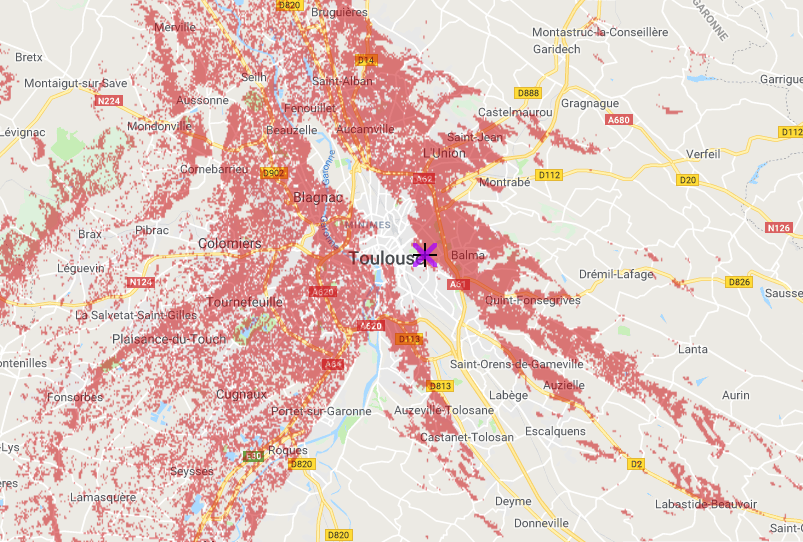

# LoRaWAN Tetaneutral.net

!!! Info
    Un projet mené par Tetaneutral.net, l'IUT de Blagnac et LinuxÉdu

## Le projet

Ce projet s'articule autour de quatre aspects :

Couverture: Offir une couverture maximale en déployant un ensemble de passerelles LoRaWAN. Certaines sont en production sur Toulouse et Albi. Tous les points Tétaneutral peuvent devenir des lieux d'installation de passerelles. Ceci est facilité par la portée de LoRa (compter autour de 5km en ville).

Ressources: Écrire un ensemble de tutoriels et ressources pédagogiques du collège à l'université. Parmi les ressources en cours d'écriture citons des relevés de pollution, de température, de position... Les aspects pédagogiques sont importants. Plusieurs enseignants et enseignantes de la région ont manifesté leur intérêt. Certains établissements vont être équipés de passerelles LoRaWAN.

Objets connectés: Proposer des objets de type Arduino et des capteurs afin de pouvoir pousser facilement des données sur nos plateformes et les traiter (visualisation, envoyer une commande selon les valeurs...)

Recherche: Fournir une plate-forme utilisable pour la recherche sur les protocoles radios, les optimisations, le réseau... En plus de la possibilité de modifier la pile radio, nous proposons des outils comme InfluxDB, Node-RED et grafana.

De façon plus sous jacente, notre ambition est de créer une extension du projet et de la philosophie de [Tetaneutral.net](http://www.tetaneutral.net/) à l'internet des objets. Le tout dans la philosophie du [logiciel libre](https://www.april.org/articles/intro/ll.html).

Pour le moment l'architecture logicielle est composée de deux parties :

- Une plateforme data qui accueille une base de donnée (influxDB) et une application web type grafana afin de les visualiser simplement. Il y a également Node-RED.

- Un serveur de réseau LoRaWAN (loraserver) afin de centraliser les flux de données qui proviennent des passerelles et les enregistrer sur la plateforme data.

Tous ces logiciels libres sont actuellement disponibles sur les serveurs de Tétaneutral. Ils sont utilisables par tous les membres du projet.

Nous avons une dizaine de passerelles en cours de configuration qui vont être déployées peu à peu.

Ce projet est soutenu par : [Tetaneutral.net](https://tetaneutral.net/), [LinuxÉdu](https://www.linuxedu.org/), [Linux-Tarn](https://blog.linuxtarn.org/), [l'IUT de Blagnac](https://www.iut-blagnac.fr/fr/), leurs sympathisants, des enseignants de collèges, lycées et universités...

Venez faire de l'open-innovation disruptive en toute agilité digitale ! ;)

Vous êtes enseignant ou enseignante en collège, lycée, université ? Dans l'éducation populaire ? Vous avez un intérêt professionnel ou simplement personnel pour ce sujet ?

Rejoignez-nous !

Liste de diffusion : [https://lists.tetaneutral.net/listinfo/iot](https://lists.tetaneutral.net/listinfo/iot)

Sur IRC : [https://kiwiirc.com/client/irc.freenode.net?chan=#tetaneutral.net](https://kiwiirc.com/client/irc.freenode.net?chan=#tetaneutral.net)
