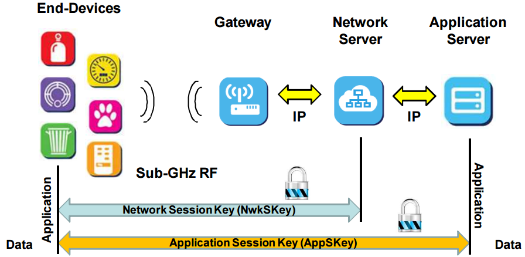
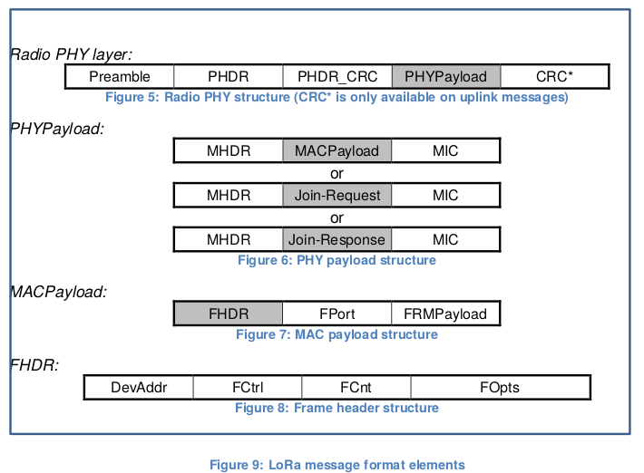

# Cryptographie et sécurité LoRaWAN

## Sécurité ?

Ce que l'on appelle *sécurité* d'un système d'information repose sur quatre piliers :

* *confidentialité* : l'information ne peut être lue par une personne non autorisée. Il doit être impossible (ou très difficile) de lire les données transmises en LoRaWAN
* *authenticité* : l'information est attribuée à son auteur légitime. On doit savoir avec certitude quel noeud a envoyé l'information.
* *intégrité* : l’information ne peut être modifiée par une personne non autorisée. L'information transmise ne peut pas être modifiée ou cela doit se voir immédiatement.
* *non-répudiation* : l'information ne peut faire l'objet d'un déni de la part de son auteur. Dans notre contexte, il faut que les données aient été envoyée et reçues par les bons matériels.

!!! tip
    Plus d'informations sur https://www.ssi.gouv.fr/particulier/bonnes-pratiques/crypto-le-webdoc/cryptologie-art-ou-science-du-secret/ et aussi https://www.cnil.fr/fr/comprendre-les-grands-principes-de-la-cryptologie-et-du-chiffrement

Voici les méthodes utilisées, en général, pour assurer ces quatre fondamentaux :

* confidentialité : chiffrement par cryptographie symétrique (à clé secrète) comme 3DES, AES... ou asymétrique (à clé publique et privée) comme RSA, ECC...
* authenticité : algorithmes de signature numérique basés sur du chiffrement
* intégrité : algorithmes de hachage comme SHA-1, MD5 ou SHA-256. On peut aussi utiliser du chiffrement.
* non-répudiation : certificat numérique là encore basé sur du chiffrement.

## Méthodes d'activation : OTAA ou ABP ?

Lors de la configuration d'un device, on doit choisir entre deux modes d'activation :

### OTAA (Over The Air Activation)

On choisit une clé _AppKey_ que l'on configure aussi dans le serveur d'application. Au démarrage, le noeud tente de se connecter par lui-même en envoyant une requête dite de "_join_" au serveur LoRaWAN via la passerelle. Si le serveur l'accepte, deux clés dites de session (_NwkSKey_ et _AppSKey_) sont négociées et générées à partir d'un "secret commun". C'est ce secret commun, _AppKey_  qui est stocké à la fois sur le noeud (en dur dans le code) et sur la passerelle. Ce processus est appelé OTAA (_Over the air activation_). Ces clés sont conservées jursqu'à leur réinitialisation.

### ABP (Activation By Personalization)

Le noeud est préconfiguré avec les clés de session "en dur" : _DevAddr_, _NwkSKey_ et _AppSKey_. À partir de ces trois clés, un "flux de clé" (_keystream_ est généré pour le chiffrement. Aucune possibilité de changer les clés après déploiement. ABP est le plus souvent utilisé pour des grands déploiements.

### Clés de sessions

Quelque soit le mode d'activation, on obtient au final deux clés de session :

* *NetworkSessionKey (NwkSkey)* qui assure l'identification (empêche des attaques du type "homme du milieu" ou une modification des messages à la volée). Elle utilise un clé AES 128 pour générer un code MIC (_Message Integrity Code_) pour chaque message.

* *Application Session key (AppSKey)* pour du chiffrement point à point du message (d'application à application).

Voici l'architecture simplifiée :



## Structure d'un paquet LoRaWAN

Avant d'aborder les aspects cryptographiques, il est important de bien comprendre comment sont structurés les paquets (où sont les données, qu'est ce qui est chiffré, etc...)



Selon les spécifications LoRaWAN (p12) un paquet est structuré de la façon suivante :

Uplink PHY structure

| Preamble | PHDR | PHDR_CRC | PHYPayload | CRC |
| -------- | ---- | -------- | ---------- | --- |

* Preamble : contient 8 octets de 0x34 dans le cas des bandes ISM 863 Mhz (Europe).
* PHDR : LoRa Physical HeaDeR
* PHDR_CRC : header CRC. CRC est un code de redondance cylclique. C'est un code détecteur d'erreur. C'est une division modulo 2 de PHDR dont le reste est le CRC.
* PHYPayload : contient le reste des informations dont les données

PHYPayload

| MHDR | MACPayload | MIC |
| ---- | ---------- | --- |

* MHDR est le _MAC Header_. Spécifie le type de message (_join request_, _data up_, _data down_...) et la version du format de la trame LoRaWAN générée. Taille : 1 octet. C'est un champ de 8 bits, les 3 premiers codent le Mtype (type de message : join request, accept, Unconfirmed Data Up,.. )
* MACPayload : ces octets contiennent le _frame header_ (FHDR), suivi de façon optionnelle du _Fport_ et de notre message _frame payload_ (FRMPayload). Voir ci-d
* MIC : Message Integrity Code de 4-octet. Il est calculé à partir de la concaténation des champs MHDR et MACPayload.

MACPayload

| FHDR | FPort | FRMPayload |
| ---- | ----- | ---------- |

* FHDR : Frame Header, contient les champs DevAddr (adresse du noeud), FCtrl (octet de controle), FCnt (2 octets pour le compteur de trames), FOpts (entre 0 et 15 octets pour les options).
* FPort : Frame Port pour déterminer si le message contient seulement des commandes MAC (vaut 0 dans ce cas) ou si les données sont spécifiques pour une application (contient alors son numéro)
* FRMPayload : notre message chiffré avant le calcul du code d'intégrité (MIC)

Le _message integrity code_ est calculé sur les champs : MHDR|FHDR|FPort|FRMPayload.

Selon les spécifications LoRaWAN 1.1, ce code MIC est calculé par `cmacS = aes128_cmac(SNwkSIntKey, B1 | msg)` où `B1` est un bloc de donnée (contenant l'adresse du noeud, la longueur de message, etc...) et `msg`, les champs définis ci-dessus. `SNwkSIntKey` est la clé dérivée à partir des AppKey et Nwkkey.

## Sécurité en mode OTAA

Comme vu, en OTAA, le device envoie une requête de _join-request_ qui contient son _AppEUI_ et _DevEUI_ accompagne d'un _DevNonce_ qui est un nombre aléatoire sur 2 octets. Si la requête est acceptée, le serveur renvoie, via la passerelle, un message de _join-accept_.

Il est intéressant de capturer cet échange et d'observer.

### Join-request

Join-request message

| AppEUI | DevEUI | DevNonce |
| ------ | ------ | -------- |

AppEUI et DevEUI sont définies dans le device. Ils ont une taille de 8 octets chacun.

DevNonce est un nombre aléatoire sur 2 octets. Il est généré par une suite de mesures du RSSI.

Ces trois valeurs sont signées avec un code d'intégrité MIC de 4 octets calculé de la façon suivante :

```
 mac=aes128_cmac(AppKey, MHDR | AppEUI | DevEUI | DevNonce)
 MIC = mac[0..3]
```

Le message de join-request n'est pas chiffré.

### Join-accept

Join-accept message


| AppNonce (3 octets) | NetID (3 octets) | DevAddr (4 octets) | DLSettings (1 octet) | RxDelay (1 octet) | CFList (16 octets, optionnel) |
| ------------------- | ---------------- | ------------------ | -------------------- | ----------------- | ----------------------------- |

* AppNonce est une valeur aléatoire utilisée par le device pour déduire les deux clés de session _NwkSkey_ et _AppSKey_ de la façon suivante :

```
 NwkSKey = aes128_encrypt(AppKey, 0x01 | AppNonce | NetID | DevNonce | pad16 )
```

```
 AppSKey = aes128_encrypt(AppKey, 0x02 | AppNonce | NetID | DevNonce | pad16 )
```

pad16 consiste en remplir avec des zéros de façon à ce que la taille de la clé soit un multiple de 16.

Le code MIC du message join-accept est calculé par :

```
 cmac = aes128_cmac(AppKey, MHDR | AppNonce | NetID | DevAddr | DLSettings | RxDelay | CFList)
 MIC = cmac[0..3]
```

Le message join-accpet est chiffré avec la _AppKey_ ainsi :

```
  aes128_decrypt(AppKey, AppNonce | NetID | DevAddr | DLSettings | RxDelay | CFList | MIC)
```

Le mode utilisé pour ce chiffrement AES par le serveur de réseau est ECB. Ainsi le device n'a besoin que de la fonction de chiffrement AES.


### Hello world, phyPayload !

!!! tip "Objectif"
    Ici nous allons déchiffrer "à la main" la payload d'un paquet LoRaWAN. Il s'agit plus précisément de la phyPayload, celle que l'on peut intercepter (avec un autre passerelle par exemple). Ce n'est absolument pas un hack car nous avons accès à toutes les clés générées... De plus le flux MQTT est accesible en clair. Le but est de comprendre le chiffrement mis en oeuvre et la structure des paquets LoRaWAN.

#### Récupérer toutes les clés de chiffrement

Comme nous venons de le voir :

* le noeud embarque la _AppKey_ qui est une clé secrète connue aussi du serveur LoRaWAN. C'est le secret partagé.
* Lors de la procédure de _join_, le noeud et le serveur définissent deux clés de session dérivées de la _AppKey_ :
** Network Session Key (NwkSkey)
** Application Session key (AppSKey)

Ces deux dernières clés sont stockées en mémoire vive sur le noeud et ne changent pas durant toute la durée de connexion. (sauf si on implément un renouvellement au niveau de l'objet)

On peut donc récupérer toutes ces clés avec une modification simple du code embarqué sur le noeud.

On ajoute le code suivant dans notre skecth :

```c
// \brief return the current session keys returned from join.
void LMIC_getSessionKeys (u4_t *netid, devaddr_t *devaddr, xref2u1_t nwkKey, xref2u1_t artKey){
  *netid = LMIC.netid;
  *devaddr = LMIC.devaddr;
  memcpy(artKey, LMIC.artKey, sizeof(LMIC.artKey));
  memcpy(nwkKey, LMIC.nwkKey, sizeof(LMIC.nwkKey));
  }

```

et on l'appelle l'automate LMIC dans le bloc :

``` c
 case EV_JOINED:
            Serial.println(F("EV_JOINED"));
            {
              u4_t netid = 0;
              devaddr_t devaddr = 0;
              u1_t nwkKey[16];
              u1_t artKey[16];
              LMIC_getSessionKeys(&netid, &devaddr, nwkKey, artKey);
              Serial.print("netid: "); Serial.println(netid, DEC);
              Serial.print("devaddr: "); Serial.println(devaddr, HEX);
              Serial.print("artKey: ");
              for (int i=0; i<sizeof(artKey); ++i) {
                if (i != 0)
                  Serial.print("-");
                Serial.print(artKey[i], HEX);
              }
              Serial.println("");
              Serial.print("nwkKey: ");
              for (int i=0; i<sizeof(nwkKey); ++i) {
                      if (i != 0)
                              Serial.print("-");
                      Serial.print(nwkKey[i], HEX);
              }
              Serial.println("");
}

            // Disable link check validation (automatically enabled
            // during join, but not supported by TTN at this time).
            LMIC_setLinkCheckMode(0);
            break;
```

Lors de la procédure de _join_, on lira dans le moniteur série :

  netid: 0
  devaddr: 593247
  artKey: F7-29-3D-74-57-DD-ED-8B-21-9-89-98-48-19-34-95
  nwkKey: D-22-33-1E-A1-4-3C-38-D3-45-6B-51-8D-7D-19-E0

!!! tip
    On peut aussi récupérer ses clés dans l'interface d'administration de loraserver.

Nous avons donc

* Device address : 00593247
* Application session key (artKey) :  F7293D7457DDED8B2109899848193495
* Network session encryption key (nwmMey) : 0D22331EA1043C38D3456B518D7D19E0
* Dans le code, la _AppKey_ est fixée à : 00000000000000000000000000000000

En s'abonnant au flux MQTT de la passerelle `gateway/+/rx`, on voit passer :

```
  gateway/3150000000000002/rx {"rxInfo":{"mac":"3150000000000002","timestamp":810156987,"frequency":868300000,"channel":1,"rfChain":1,"crcStatus":1,"codeRate":"4/5","rssi":-59,"loRaSNR":8.8,"size":21,"dataRate":{"modulation":"LORA","spreadFactor":7,"bandwidth":125},"board":0,"antenna":0},"phyPayload":"QEcyWQDCAQADBwEydIFTnJG/1DGF"}
```

Comme nous l'avons vu, la payload a été chiffrée deux fois en AES128 : une fois avec la clé d'application (AppSKey) et une fois avec la clé de réseau (NwkSKey). Voici quelques payloads successives. On voit que la plupart du texte chiffré varie à chaque fois :

```
QEcyWQDCAQADBwEydIFTnJG/1DGF
QEcyWQDCAgADBwGj/lQyPonTT2JD
QEcyWQDCAwADBwFRghM4kgf0TbxU
QEcyWQDCBAADBwGbxnlIxJ9vSP8K
QEcyWQCABQABAFLbnP0e+aFMzA==
QEcyWQCABgABx4VOzRcncgrReQ==
QEcyWQCABwAB1GOiHsCSPF0FbA==
QEcyWQCACAABOc/qa6Pz8meWCA==
QEcyWQCACQAB52tKleR9eWCukg==
QEcyWQCACgABZ88CTgX2m0WhPg==
QEcyWQCACwABfx7Dk4HJjHE31A==
QEcyWQCADAABUdGFyvfIj/v+Vg==
QEcyWQCADQABL10QcX7gZ5xM7w==
QEcyWQCADgABNJ/OQm1fW66plA==
QEcyWQCADwABgH8JNXv61Qyuew==
QEcyWQCAEAABMXgpiSY17QaYdA==
QEcyWQDAEQABeFpyNh9lZUqNqg==
QEcyWQCAEgABflsMzfdG1nM0xw==
```

Selon les spécifications, l'algorithme de chiffrement AES128 est utilisé pour générer un flux de clés (_keystream_). Pour chaque clé, le chiffré de la payload est obtenu en faisant un XOR entre le clair de la payload et la "clé".

Ce n'est bien entendu pas un chiffrement optimal en théorie car une personne très motivée pourrait déchiffrer la payload... Il lui faudra un très grand nombre de messages chiffrés pour arriver à découvrir la payload en clair.

Pour la suite de la documentation, contactez-nous ! En effet, c'est un des TPs de cryptographie à l'IUT de Blagnac :)


### Failles de sécurités ?

* You need much less skills to read any key: simply connect 3 wires (tx rx gnd) to the LoRa module and read the keys easily, using the standard commands, published in the documentation.

    [https://github.com/anthonykirby/lora-packet](https://github.com/anthonykirby/lora-packet)

* Les clés de chiffrement sont des constantes dans le code.

* Les clés sont stockées en mémoire flash ou EEPROM (non sécurisées)

* Dès qu'une des deux clés est compromise... probable lorsque le noeud est accessible physiquement ou non surveillé, il doit être possible de dupliquer la clé

* Une fois la compromission faite, il est impossible de changer la clé AES sur le noeud (s'il n'y a pas d'autre canal securisé pour accéder au noeud)

## Bonnes pratiques

* Éviter le mode ABP car les clés de sessions sont stockées en dur et ne sont pas renouvelables facilement.

* Chaque device doit avoir une AppKey différente. Si un device est compromis, seul celui-ci sera concerné et pas l'ensemble du parc

* Prévoir une autre bande ou un autre canal sécurisé pour changer la AppKey.

* utiliser une longueur de messages fixe (padding)

* Générer des clés uniques pour chaque noeud à l'aide d'un bon générateur de nombres peudos-aléatoires. En général, il semble que le générateur utilisé soit une suite de mesure du RSSI.

* Utiliser OTAA mais forcer périodiquement un _rejoin_ pour changer les clés de session.

* En ABP, faire en sorte que les clés de session soient uniques pour chaque device.

* Use a secure hardware element in a device to store the security credentials (en Bluetooth ou autre) mais aussi pour effectuer les opérations relatives à la vérofication d'intégrité des messages, le chiffrement et le déchiffrement. This will make it very hard to reverse-engineer the keys by scanning device memories. Additionally, use secure boot to ensure integrity of device firmware.

* Ajouter une couche supplémentaire de chiffrement à la couche application. On peut utiliser un chiffrement asymétrique.

* Toujours activer le compteur des messages uplink/downlink dans le serveur de réseau pour éviter les _replay attacks_

* You can use your own private network server and/or application server with own gateways to prevent unauthorized access at the cloud level

* Envoyer des messages aléatoires à intervalles irréguliers pour éviter les attaques de collecte de métadonnées et masquer l'activité (activités du noeud en fonction des événements (quelqu'un sonne à la porte un message est envoyé...)

LoRaWAN was designed for hardware-constrained devices, so it had to balance many tradeoffs. Also, keep in mind that most applications are for sending data from distributed sensors to the cloud, not for controlling ATM cash dispensers. For typical applications, it's an easy to use, cheap, and effectively secure solution.

## Ressources

[https://labs.mwrinfosecurity.com/assets/BlogFiles/mwri-LoRa-security-guide-1.2-2016-03-22.pdf](https://labs.mwrinfosecurity.com/assets/BlogFiles/mwri-LoRa-security-guide-1.2-2016-03-22.pdf)

Approche de la cryptanalyse de la séquence des blocs de chiffrement : [https://www.miscmag.com/lorawan-deploiement-dune-infrastructure-de-test-partie-2-2/](https://www.miscmag.com/lorawan-deploiement-dune-infrastructure-de-test-partie-2-2/)

Webinar de The things network "LoRaWAn Security" : [https://www.youtube.com/watch?v=Nu_yZelDMZI&feature=player_embedded](https://www.youtube.com/watch?v=Nu_yZelDMZI&feature=player_embedded) par @johamstokking johan@thehingsnetwork.org

[https://security.stackexchange.com/questions/126987/security-of-an-iot-network-using-aes-lorawan](https://security.stackexchange.com/questions/126987/security-of-an-iot-network-using-aes-lorawan)

[lora-packet](https://github.com/anthonykirby/lora-packet) ou encore sa [version web](https://lorawan-packet-decoder-0ta6puiniaut.runkit.sh/).

En explorant le code de l'outils nous avons remarqué qu'ils utilisaient les librairies standars de cryptage de leurs langages respectifs (comme [CryptoJS](https://github.com/brix/crypto-js))

Voir [https://www.elektormagazine.com/news/lorawan](https://www.elektormagazine.com/news/lorawan) (à vérifier dans les specifications)

Lorsque vous souhaitez décoder et déchiffrer un LoRaWAN PHYPayload vous-même, veuillez consulter: [https://godoc.org/github.com/brocaar/lorawan#example-PHYPayload--Decode](https://godoc.org/github.com/brocaar/lorawan#example-PHYPayload--Decode) 142

Pour simplement déchiffrer le FRMPayload, veuillez consulter: [https://godoc.org/github.com/brocaar/lorawan#EncryptFRMPayload](https://godoc.org/github.com/brocaar/lorawan#EncryptFRMPayload) 114
