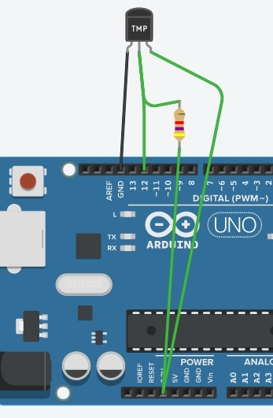
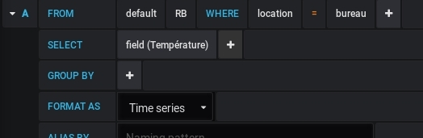

# Capteur de température


!!! tip "Objectif"
    Relever la température mesurée par l'objet, l'envoyer par SMS et représenter graphiquement son évolution.
    Matériel utilisé : Feather M0 et capteur de température DS18B20.
    Ce projet sera fait de deux façons : en `C` et en `python`.


Nous allons envoyer la température dans un paquet LoRaWAN pour la récupérer via MQTT et l'envoyer par SMS (avec [Node-RED](https://nodered.org/)).

Nous utiliserons également [Grafana](https://grafana.com/) pour représenter les données après les avoir importée dans une base de donnée [InfluxDB](https://www.influxdata.com/).

Tous ces outils sont accessibles sur les serveurs de [Tetaneutral.net](https://tetaneutral.net/).

## Capteur de température DS18B20

Nous utiliserons un capteur de température numérique de type "one-wire" DS18B20.

Voir la datasheet du composant : [https://datasheets.maximintegrated.com/en/ds/DS18B20.pdf](https://datasheets.maximintegrated.com/en/ds/DS18B20.pdf)

### Librairies

Installez les librairies :

* `OneWire` via l'IDE Arduino
* `DallasTemperature` que vous trouverez ici : [https://github.com/milesburton/Arduino-Temperature-Control-Library](https://github.com/milesburton/Arduino-Temperature-Control-Library)

### Cablage

En prenant le DS18B20 avec le méplat face à vous, la masse est à gauche, l'alimentation à droite et le bus de données au milieu.

Le cablage ci-dessous est pour Arduino mais c'est la même chose avec un feather...



## Sketch d'exemple

``` c
/*******************************************************************************
 * Copyright (c) 2015 Thomas Telkamp and Matthijs Kooijman
 * Modifié par NG et RB (IUT de Blagnac). *
 * This uses OTAA (Over-the-air activation).
 *
 * This code use a "one-wire" DS18B20 temperature sensor
 * and send this temperature to loraserver.
 *
 * With the help of Node-Red and influsDB, one can easily plot temperature ! *
 *
 *******************************************************************************/

#include <Arduino.h>
#include <lmic.h>
#include <hal/hal.h>
#include <SPI.h>
#include <OneWire.h>
#include <DallasTemperature.h>

/******************************************************************************/
/* OneWire                                                                    */
/******************************************************************************/
// DS18B20 on Feather M0

#define ONE_WIRE_BUS 12

// Setup a oneWire instance to communicate with any OneWire devices (not just Maxim/Dallas temperature ICs)
OneWire oneWire(ONE_WIRE_BUS);

// Pass our oneWire reference to Dallas Temperature.
DallasTemperature sensors(&oneWire);

float temp_float;

/******************************************************************************/
/* LoRaWAN                                                                    */
/******************************************************************************/

// This EUI must be in *little-endian format* (least-significant-byte first)
// Necessaire pour le protocole mais inutile pour l'implémentation dans loraserver
// On peut donc mettre de l'aléatoire ou :

static const u1_t APPEUI[8]={ 0x00, 0x00, 0x00, 0x00, 0x00, 0x00, 0x00, 0x00  };

// DEVEUI should also be in *little endian format*

static const u1_t DEVEUI[8]={ 0x0b, 0x07, 0x06, 0x05, 0x04, 0x03, 0x02, 0x01 };

// This key should be in big endian format

static const u1_t APPKEY[16] = { 0x00, 0x00, 0x00, 0x00, 0x00, 0x00, 0x00, 0x00, 0x00, 0x00, 0x00, 0x00, 0x00, 0x00, 0x00, 0x00 };

// Copie en mémoire des EUI et APPKEY
void os_getArtEui (u1_t* buf) { memcpy_P(buf, APPEUI, 8);}
void os_getDevEui (u1_t* buf) { memcpy_P(buf, DEVEUI, 8);}
void os_getDevKey (u1_t* buf) { memcpy_P(buf, APPKEY, 16);}

// Schedule TX every this many seconds (might become longer due to duty
// cycle limitations).
const unsigned TX_INTERVAL = 20;

/******************************************************************************/
/* pin mapping                                                                */
/******************************************************************************/

const lmic_pinmap lmic_pins = {
    .nss = 8,
    .rxtx = LMIC_UNUSED_PIN,
    .rst = LMIC_UNUSED_PIN,
    .dio = {3, 6, LMIC_UNUSED_PIN},//io1 pin is connected to pin 6, io2 vers pin 11
};

/******************************************************************************/
/* fonction do_send                                                           */
/******************************************************************************/

void do_send(osjob_t* j){
    // Check if there is not a current TX/RX job running
    if (LMIC.opmode & OP_TXRXPEND) {
        Serial.println(F("OP_TXRXPEND, not sending"));
    } else {  
      Serial.print("Requesting temperatures...");

      sensors.requestTemperatures(); // Send the command to get temperatures
      Serial.println("DONE");

      // After we got the temperatures, we can prepare the payload.
      // We use the function ByIndex, and as an example get the temperature from the first sensor only.
      // Serial.print("Temperature for the device 1 (index 0) is: ");

      float temperature = sensors.getTempCByIndex(0);
     //Serial.print("Temperature for the device 1 (index 0) is: ");
     //Serial.println(temperature);
      // We have to convert the float into an ASCII representation
      // and load the paylod

      // we build the packet and concatenate text with float to string + 3 décimales

      String packet = String(temperature, 3);
      Serial.println(packet[0]);

      uint8_t lmic_packet[packet.length()+1];

      for(int i=0; i<packet.length()+1; i++){
        lmic_packet[i] = packet[i];
      }
      Serial.println(lmic_packet[0]);

       // Prepare upstream data transmission at the next possible time.

      LMIC_setTxData2(1, lmic_packet, sizeof(lmic_packet)-1, 0);

      Serial.println(F("Packet queued"));
    }
    // Next TX is scheduled after TX_COMPLETE event.
}
/******************************************************************************/
/* Automate LMIC                                                              */
/******************************************************************************/


static osjob_t sendjob;

void onEvent (ev_t ev) {
    Serial.print(os_getTime());
    Serial.print(": ");
    switch(ev) {
        case EV_JOINING:
            Serial.println(F("EV_JOINING"));
            break;
        case EV_JOINED:
            Serial.println(F("EV_JOINED"));

            // Disable link check validation (automatically enabled
            // during join, but not supported by TTN at this time).
            LMIC_setLinkCheckMode(0);
            break;
        case EV_JOIN_FAILED:
            Serial.println(F("EV_JOIN_FAILED"));
            break;
            break;
        case EV_TXCOMPLETE:
            Serial.println(F("EV_TXCOMPLETE (includes waiting for RX windows)"));
            if (LMIC.txrxFlags & TXRX_ACK)
              Serial.println(F("Received ack"));
            if (LMIC.dataLen) {
              Serial.println(F("Received "));
              Serial.println(LMIC.dataLen);
              Serial.println(F(" bytes of payload"));
            }
            // Schedule next transmission
            os_setTimedCallback(&sendjob, os_getTime()+sec2osticks(TX_INTERVAL), do_send);
            break;
        case EV_RXCOMPLETE:
            // data received in ping slot
            Serial.println(F("EV_RXCOMPLETE"));
            break;
        default:
            Serial.println(F("Unknown event, voir doc lmic"));
            break;
    }
}


void setup() {
    Serial.begin(9600);

    //**** OneWire ****
    Serial.println("Dallas Temperature IC Control Library Demo");
    // Start up the library
    sensors.begin();

    while (millis() < 5000) {
    Serial.print("millis() = "); Serial.println(millis());
    delay(500);
    }

    Serial.println(F("Starting"));

    #ifdef VCC_ENABLE
    // For Pinoccio Scout boards
    pinMode(VCC_ENABLE, OUTPUT);
    digitalWrite(VCC_ENABLE, HIGH);
    delay(1000);
    #endif

    // LMIC init
    os_init();
    // Reset the MAC state. Session and pending data transfers will be discarded.
    LMIC_reset();
    LMIC_setClockError(MAX_CLOCK_ERROR * 10 / 100);
    // Start job (sending automatically starts OTAA too)
    do_send(&sendjob);
}

void loop() {
  // call sensors.requestTemperatures() to issue a global temperature
  // request to all devices on the bus
  //Serial.print("Requesting temperatures...");
  //sensors.requestTemperatures(); // Send the command to get temperatures
  //Serial.println("DONE");
  // After we got the temperatures, we can print them here.
  // We use the function ByIndex, and as an example get the temperature from the first sensor only.
  //Serial.print("Temperature for the device 1 (index 0) is: ");
  //Serial.println(sensors.getTempCByIndex(0));

  os_runloop_once();
}
```

En s'abonnant au flux MQTT de notre `node` :

``` shell
 mosquitto_sub -h loraserver.tetaneutral.net -v -t application/5/device/010203040506070b/#
```

Nous obtenons :

``` shell
 application/5/device/010203040506070b/rx {"applicationID":"5","applicationName":"RB-home","deviceName":"RB-feather-M0","devEUI":"010203040506070b","rxInfo":[{"gatewayID":"3150000000000002","name":"toulouse_remi","rssi":-96,"loRaSNR":6.2,"location":{"latitude":43.60625069174644,"longitude":1.4709877967834475,"altitude":204}}],"txInfo":{"frequency":868300000,"dr":5},"adr":true,"fCnt":58,"fPort":1,"data":"MjMuMzc1"}
```

La commande :

``` shell
 echo "MjMuMzc1" | base64 -d
```

renvoie bien la température.

## Envoyer la température par SMS (via Node-RED)

### Installation de Node-RED

!!! tip
    Si vous avez un compte sur le Node-RED de Tetaneutral.net, passez cette étape.

Installer Node-RED via les depôts ou utiliser un container docker (recommandé) ou encore un de nos services Noede-RED.

Premier lancement du container :

``` shell
 docker run -d -p 1880:1880 -v nodered_data:/data --name mynodered nodered/node-red-docker
```

Puis à l'avenir :

``` shell
 docker start mynodered
```

Accès à Node-RED : http://localhost:1880/

### Envoyer la température par SMS

Ajoutez la "palette" `sms-free-mobile` dans Node-RED

Activez les "notifications par SMS" dans votre espace free-mobile (via Gérer mon compte/Mes options). Récupérez la clé d'identification au service.

Configurez la palette MQTT comme ci-dessous :


Pour avoir un flux du type :


La palette fonction "message décodé" contient :


C'est tout !

## Représenter les données dans grafana

### Pousser les données dans influxDB

Toujours dans node-RED configurer comme suit :


La fonction _Get Temperature_ contient :

``` javascript
var newMsg = { payload: parseFloat(msg.payload.data) };
return newMsg;
```

_Format for influxdb_ :

``` javascript
var newMsg = { payload: [{'Température': msg.payload}, {'location': 'bureau'}] };
return newMsg;
```

### Affichage dans grafana

Il suffit de paramétrer un panel comme suit :



## En python

### Afficher la température

Suivre la [documentation d'installation de CircuitPython](https://boulle.frama.io/LoRaWAN-tetaneutral/post/feather-m0-lorawan-node/).

Comme le capteur de température est un OneWire, il nous faut les pilotes à récupérer dans le bundle d'Adafruit :

[https://github.com/adafruit/Adafruit_CircuitPython_Bundle/releases/latest](https://github.com/adafruit/Adafruit_CircuitPython_Bundle/releases/latest)

Selon votre version de CircuitPython, choisir le bon _bundle_ et copier/coller dans le répertoire `lib` les fichiers ou dossiers suivants :

* `adafruit_onewire`
* `adafruit_ds18x20.mpy`

Le code suivant (venant du dépôt gitub du bundle) permet de tester que tout fonctionne :

``` python
# Simple demo of printing the temperature from the first found DS18x20
# sensor every second.
# Author: Tony DiCola

import time

import board

from adafruit_onewire.bus import OneWireBus
from adafruit_ds18x20 import DS18X20

# Initialize one-wire bus on board pin D5.
ow_bus = OneWireBus(board.D12)

# Scan for sensors and grab the first one found.
ds18 = DS18X20(ow_bus, ow_bus.scan()[0])

# Main loop to print the temperature every second.
while True:
    print('Temperature: {0:0.3f}C'.format(ds18.temperature))
    print('Temp:{}'.format(ds18.temperature))
    time.sleep(1.0)
```

C'est le code trouvé dans la https://github.com/adafruit/Adafruit_CircuitPython_Bundle/releases/latest
[page du bundle] dans le fichier `adafruit-circuitpython-bundle-examples`.

### Envoyer la température en LoRaWAN

Il suffit de fusionner le code ci-dessus avec celui de la page de mise en place du Feather M0 : [https://boulle.frama.io/LoRaWAN-tetaneutral/post/feather-m0-lorawan-node/](https://boulle.frama.io/LoRaWAN-tetaneutral/post/feather-m0-lorawan-node/)

``` python
import time
import busio
import digitalio
import board

from adafruit_tinylora.adafruit_tinylora import TTN, TinyLoRa
from adafruit_onewire.bus import OneWireBus
from adafruit_ds18x20 import DS18X20

# Board LED
led = digitalio.DigitalInOut(board.D13)
led.direction = digitalio.Direction.OUTPUT

# Config chipset radio
spi = busio.SPI(board.SCK, MOSI=board.MOSI, MISO=board.MISO)

# FeathM0 RFM9xPinout
cs = digitalio.DigitalInOut(board.RFM9X_CS)
irq = digitalio.DigitalInOut(board.RFM9X_D0)

# TTN Device Address, 4 Bytes, MSB
devaddr = bytearray([0x00, 0x22, 0x46, 0xe6])

# TTN Network Key, 16 Bytes, MSB
nwkey = bytearray([0x00, 0x00, 0x00, 0x00, 0x00, 0x00, 0x00, 0x00,
                   0x00, 0x00, 0x00, 0x00, 0x00, 0x00, 0x00, 0x00])

# TTN Application Key, 16 Bytess, MSB
app = bytearray([0x00, 0x00, 0x00, 0x00, 0x00, 0x00, 0x00, 0x00,
                 0x00, 0x00, 0x00, 0x00, 0x00, 0x00, 0x00, 0x00])

ttn_config = TTN(devaddr, nwkey, app, country='EU')

lora = TinyLoRa(spi, cs, irq, ttn_config)

# Initialize one-wire bus on board pin D5.
ow_bus = OneWireBus(board.D12)

# Scan for sensors and grab the first one found.
ds18 = DS18X20(ow_bus, ow_bus.scan()[0])

# Main loop to print and send the temperature.
while True:
    print('Temperature: {0:0.3f}C'.format(ds18.temperature))
    data=bytes('{0:0.3f}C'.format(ds18.temperature), 'utf-8')
    print('Sending packet..')
    led.value = True
    lora.send_data(data, len(data), lora.frame_counter)
    print('Packet sent!')
    led.value = False
    lora.frame_counter += 1
    time.sleep(10)
```

### Recevoir des données

Pas encore implémenté dans la librairie : [https://github.com/adafruit/Adafruit_CircuitPython_TinyLoRa](https://github.com/adafruit/Adafruit_CircuitPython_TinyLoRa)

Voir : [https://github.com/adafruit/Adafruit_CircuitPython_TinyLoRa/issues/7](https://github.com/adafruit/Adafruit_CircuitPython_TinyLoRa/issues/7)

Peut-être porter la stack LoRaWAN : [https://github.com/jeroennijhof/LoRaWAN](https://github.com/jeroennijhof/LoRaWAN) sous micropython ?

### MQTT

On peut récupérer les données en MQTT :

``` shell
 mosquitto_sub -h loraserver.tetaneutral.net -v -t "application/5/device/010203040506070a/rx"
```
