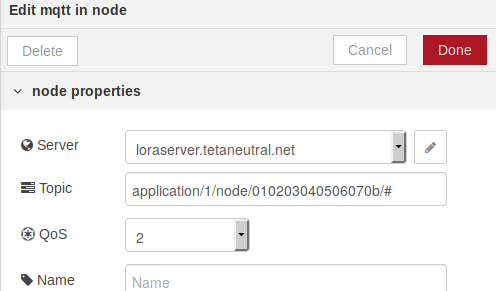
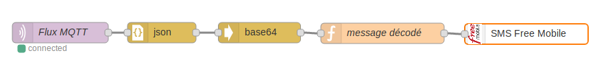

# Utiliser Node-RED avec MQTT
## Installation

Installer Node-RED via les depôts ou utiliser un container docker (recommandé).

Premier lancement du container :

``` shell
 docker run -d -p 1880:1880 -v nodered_data:/data --name mynodered nodered/node-red-docker
```

Puis à l'avenir :

``` shell
 docker start mynodered
```

Accès à Node-RED : [http://localhost:1880/](http://localhost:1880/)

Ajoutez la "palette" sms-free-mobile

## Envoyer un message extrait du flux MQTT par SMS

Activez les "notifications par SMS" dans votre espace free-mobile (via Gérer mon compte/Mes options). Récupérez la clé d'identification au service.

Configurez la palette MQTT comme ci-dessous :



Pour avoir un flux du type :



La palette fonction "message décodé" contient :


C'est tout !
